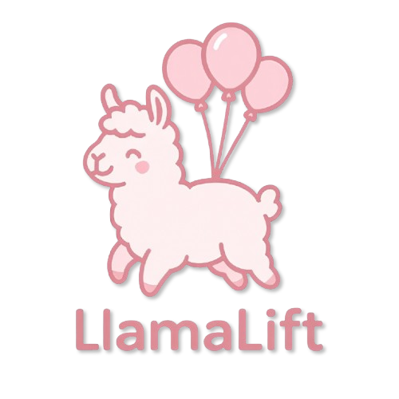

[](assets/LlamaLift.png)

**A simple Rust & egui based GUI application for managing models on a local or remote Ollama server.**

---

🚨  **CRITICAL WARNING: VIBE CODED & UNTRUSTWORTHY** 🚨 

> This application was developed based purely on vibes, guesswork, and maybe a little bit of Stack Overflow driven development. **It has NOT undergone rigorous testing, formal verification, or any semblance of professional quality assurance.**
>
> **DO NOT TRUST THIS APPLICATION WITH CRITICAL DATA OR IN PRODUCTION ENVIRONMENTS.**
>
> Expect bugs, unexpected behavior, crashes, or potentially even data loss (though hopefully just limited to Ollama models!). Use at your own absolute risk. It's provided "as-is" for experimental purposes only.

---

## Overview

LlamaLift provides a simple graphical user interface to interact with an [Ollama](https://github.com/ollama/ollama/blob/main/docs/api.md) instance. It allows you to:

* **List:** View models currently downloaded on the Ollama server.
* **Download:** Pull new models from the Ollama library (or specified sources).
* **Delete:** Remove models from the Ollama server.

It features a simple two-tab interface, real-time progress updates for downloads, and an integrated log viewer.

## Screenshots TODO


## Features

* **Graphical User Interface:** Built with Rust's `egui` library (via `eframe`).
* **Ollama Interaction:** Connects to a specified Ollama host (`OLLAMA_HOST`).
    * Includes an initial connectivity check on startup.
* **Model Listing & Management:**
    * Displays downloaded models with name, size (human-readable), and last modified date (respecting local timezone).
    * Shows additional model details: Digest (shortened with full digest on hover), Format, Family, Families, Parameter Size, and Quantization Level.
    * Table columns are configurable via a "Select Columns" window, allowing users to choose which details to display.
    * Column widths in the model table are persistent and saved across sessions.
    * Enhanced sorting capabilities: sort models by various attributes (Name, Size, Modified Date, Digest, etc.). The sort state (column and direction) is also persistent.
* **Model Download:**
    * Enter one or multiple model identifiers (e.g., `llama3:latest`, `mistral`).
    * Dynamically add or remove model input fields in the "Download Models" view (up to 100 fields).
    * Supports batch downloading of multiple models sequentially.
    * Streams download progress from Ollama, showing status messages and a progress bar per layer/file.
    * Displays an overall progress bar for the entire batch download in addition to individual model progress.
* **Model Deletion:**
    * Select models from the list to delete.
    * Includes a confirmation dialog to prevent accidental deletion.
* **Configuration:**
    * Reads initial defaults from `.env` file or environment variables (`OLLAMA_HOST`, `LOG_LEVEL`, `TZ`).
    * Uses `confy` for persistent runtime settings (Ollama host, log level, timezone, table column states, and sort state) stored in a platform-specific configuration file.
    * Provides an in-app "Settings" window to modify these persistent settings.
    * Settings changes in the window are staged and only applied upon explicit "Save & Close", allowing changes to be cancelled.
    * The path to the active configuration file is displayed within the Settings window.
* **Logging:**
    * Logs application events using `env_logger`.
    * Displays INFO level (and higher) logs directly within a collapsible panel in the GUI.
    * Log timestamps respect the configured timezone (`TZ`).
    * Allows copying all displayed logs to the clipboard via the "Help" menu.
* **Cross-Platform (Potentially):** Built with Rust, should work on Windows, macOS, and Linux (may require dependencies, see Building from Source).

## Requirements

* **An Ollama Server:** You need a running Ollama instance. This can be running locally or on a remote machine accessible from where you run LlamaLift.
* **Network Access:** LlamaLift needs network access to reach the specified Ollama host and port (default `127.0.0.1:11434`).

## Installation / Getting Started

### 1. Pre-built Binaries (Recommended for End Users)

Check the **Releases** page of this GitHub repository: [https://github.com/unbraind/LlamaLift/releases](https://github.com/unbraind/LlamaLift/releases) 

Download the appropriate executable file for your operating system (e.g., `.exe` for Windows, a binary for Linux/macOS). No installation is usually required; just run the downloaded file.

### 2. Building from Source (For Developers / Advanced Users)

If you prefer to build it yourself or if binaries are not provided for your platform:

1.  **Install Rust:** If you don't have it, install the Rust toolchain from [rustup.rs](https://rustup.rs/).
2.  **Clone the Repository:**
    ```bash
    git clone [https://github.com/unbraind/LlamaLift.git](https://github.com/unbraind/LlamaLift.git)
    cd LlamaLift
    ```
3.  **System Dependencies:** `eframe` (the GUI framework used) might require certain system libraries for building.
    * **Linux:** You might need to install development packages for GUI libraries. Common requirements include libraries for X11, Wayland, and potentially GTK or other windowing system components. For example:
        * Debian/Ubuntu: `sudo apt-get update && sudo apt-get install libxcb-render0-dev libxcb-shape0-dev libxcb-xfixes0-dev libxkbcommon-dev libgtk-3-dev libwayland-dev libegl1-mesa-dev libfontconfig1-dev libdbus-1-dev`
        * Fedora: `sudo dnf install libxcb-devel libxkbcommon-devel gtk3-devel wayland-devel mesa-libEGL-devel fontconfig-devel dbus-devel`
    * **macOS/Windows:** Dependencies are usually handled more automatically by Cargo and the Rust toolchain, but ensure your build environment is set up (e.g., Xcode Command Line Tools on macOS, Build Tools for Visual Studio on Windows if compiling native modules that might need them, though `eframe` aims to minimize this).
    * *(For the most up-to-date and comprehensive list, please refer to the `eframe` or `egui` documentation for your specific operating system and distribution.)*
4.  **Build:**
    ```bash
    cargo build --release
    ```
5.  **Run:** The executable will be located in `./target/release/LlamaLift` (or `LlamaLift.exe` on Windows).

## Configuration

LlamaLift uses a layered configuration approach:

1.  **Environment Variables / `.env` File (Initial Defaults):**
    * Upon first launch *without* a persistent configuration file, LlamaLift will look for a `.env` file in the directory it's run from OR check environment variables for initial settings.
    * Create a file named `.env` in the same directory as the executable (or set environment variables) with the following (optional) keys:
        ```dotenv
        # .env Example
        OLLAMA_HOST=192.168.1.100:11434  # Default: 127.0.0.1:11434
        LOG_LEVEL=DEBUG                 # Default: INFO (Options: TRACE, DEBUG, INFO, WARN, ERROR)
        TZ=Europe/Vienna             # Default: Europe/Vienna (Use IANA timezone names)
        ```
2.  **Persistent Settings (`confy`):**
    * After the first run (or if modified via the Settings window), LlamaLift uses `confy` to store settings persistently. These settings **override** any `.env`/environment variables.
    * The configuration file location depends on your OS:
        * **Linux:** `~/.config/LlamaLift/default-config.toml` (or `$XDG_CONFIG_HOME/LlamaLift/default-config.toml`)
        * **macOS:** `~/Library/Application Support/dev.unbrained.LlamaLift/default-config.toml`
        * **Windows:** `C:\Users\<YourUsername>\AppData\Roaming\unbrained\LlamaLift\config\default-config.toml`
    * You can check the application logs upon startup to see the exact path being used.
3.  **In-App Settings Window:**
    * Go to `File -> Settings` within the application.
    * You can view the config file path and modify `Ollama Host`, `Log Level`, and `Timezone`.
    * Clicking "Save & Close" writes changes to the persistent `confy` file.
    * **Note:** Changes to `Log Level` and `Timezone` require an application restart for the log *formatting* (timestamps, visible levels) to fully update, although the underlying logging behaviour might change immediately.

## Usage

1.  **Launch:** Run the executable.
2.  **Configure (if necessary):** Ensure the `OLLAMA_HOST` points to your Ollama server either via `.env`/environment variable on first run or via the `File -> Settings` menu.
3.  **Manage Models View:**
    * This is the default view.
    * Click `🔄 Refresh List` to fetch the list of models from the Ollama server.
    * Models are displayed in a table.
    * Click the `🗑 Delete` button next to a model to remove it (a confirmation prompt will appear).
4.  **Download Models View:**
    * Switch to this view using the top selector buttons.
    * Enter one or more model identifiers (e.g., `llama3`, `mistral:7b-instruct-q4_K_M`) into the text fields. An empty field automatically adds a new input row (up to 100). Use the ➖ button to remove fields.
    * Click `Download Models`.
    * The application will download the models sequentially. Progress for the current download is shown in the progress bar and status text. Detailed steps are logged in the "Logs" panel.
5.  **Logs Panel:**
    * Located at the bottom of both views. Click the header ("Logs") to expand or collapse it.
    * Shows INFO, WARN, and ERROR level messages from the application.
    * Use `Help -> Copy Logs` to copy the entire content of the log panel to your clipboard.
6.  **Menu Bar:**
    * `File -> Settings`: Open the persistent settings window.
    * `File -> Quit`: Close the application.
    * `Help -> Copy Logs`: Copy visible logs to clipboard.
    * `Help -> About`: Show the About window.

## Troubleshooting / Known Issues

* **Connection Errors:** If you see errors mentioning connection refused or timeouts, double-check the `OLLAMA_HOST` in the Settings window and ensure your Ollama server is running and accessible from the machine running LlamaLift. Check firewalls if necessary.
* **Incorrect Dates/Times:** Ensure the `TZ` setting (in `.env` initially or Settings window) is a valid IANA Timezone Database name (e.g., `Europe/Berlin`, `America/Los_Angeles`, `UTC`). Restart the app after changing the timezone in Settings for log formats to update.
* **Slow UI during Download/List:** The UI might become less responsive during network operations, although efforts are made to run these asynchronously.
* **It's Vibe Coded:** Seriously, expect things to break. If something goes wrong, check the Logs panel or the console output (if running from a terminal) for error messages. Feel free to report issues, but remember the disclaimer!

## Dependencies

LlamaLift relies on several great Rust crates, as specified in `Cargo.toml`:

* **GUI Framework:**
    * `eframe` (with `persistence` feature)
    * `egui`
    * `egui_extras` (for table functionality)
* **Asynchronous Operations:**
    * `tokio` (with `rt-multi-thread`, `macros` features)
    * `futures-util`
* **HTTP & Networking:**
    * `reqwest` (with `json`, `stream` features)
* **Serialization & Configuration:**
    * `serde` (with `derive` feature)
    * `serde_json`
    * `confy`
    * `dotenvy`
* **Logging:**
    * `log`
    * `env_logger`
* **Date & Time:**
    * `chrono` (with `serde` feature)
    * `chrono-tz`
* **Image Handling:**
    * `image` (with `png` feature, default features disabled)
* **Build (Windows Specific):**
    * `winres` (in `[build-dependencies]`)

## License

[MIT](LICENSE)

---

*LlamaLift - Gently lifting your Ollama models.*
